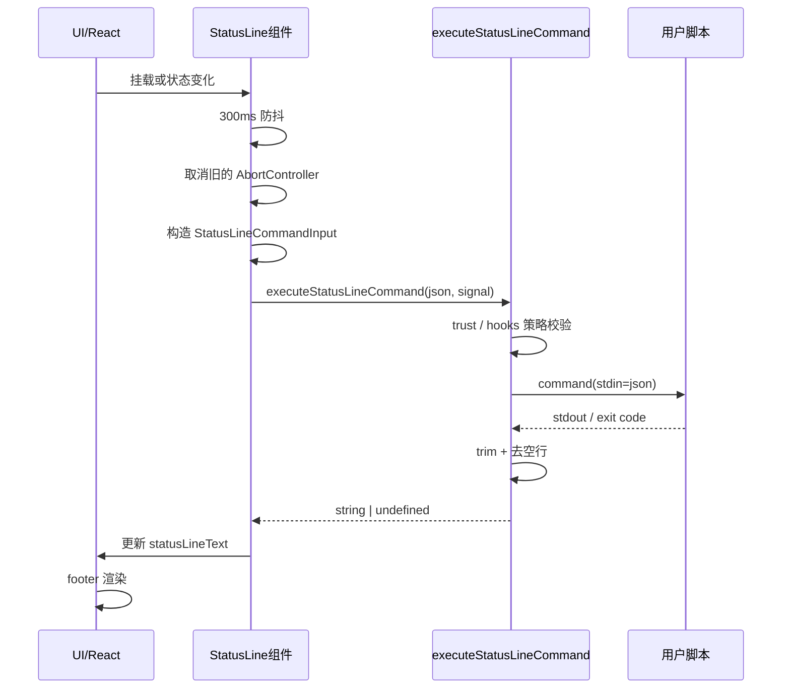

# Claude Code `statusLine` 技术复刻文档

## 1. 文档目标

本文档基于两类材料整理：

1. 官方文档《自定义你的状态行》  
   来源：<https://code.claude.com/docs/zh-CN/statusline>
2. 当前仓库中的真实实现
   - `src/commands/statusline.tsx`
   - `src/components/StatusLine.tsx`
   - `src/tools/AgentTool/built-in/statuslineSetup.ts`
   - `src/utils/hooks.ts`
   - `src/utils/settings/types.ts`
   - `src/components/PromptInput/PromptInputFooter.tsx`
   - `src/components/hooks/HooksConfigMenu.tsx`

目标不是介绍“如何用 Claude 配一下状态栏”，而是沉淀一份可以让其他工程师从零实现同类能力的工程文档。读者读完后，应该能够构建出一个与 Claude Code `statusLine` 在核心机制上等价的系统：

- 用户在配置里声明一个 `statusLine.command`
- 宿主程序在合适时机执行该命令
- 宿主把当前会话状态序列化为 JSON，通过 `stdin` 传给脚本
- 脚本输出的 `stdout` 被宿主采集并渲染到底部状态区
- 状态区支持多行、ANSI 颜色、OSC 8 链接
- 系统具备防抖、取消、超时、trust gating、策略禁用等工程保障

本文会同时指出“官方文档给出的公开契约”和“当前源码里的真实行为”。如果两者存在差异，会单独标注。

由于目标读者无法直接阅读当前仓库源码，本文档会直接嵌入理解该功能所必需的关键源码片段。这里的源码片段只保留关键路径，不保留与主题无关的外围上下文，但会尽量保持原始命名和真实控制流，确保读者不依赖仓库也能完整复刻。

---

## 2. 先定义问题：`statusLine` 到底是什么

Claude Code 的 `statusLine` 本质上不是一个 UI 小组件，而是一套“可执行状态投影协议”：

- 宿主程序维护当前会话状态
- 宿主把状态投影成一个 JSON 对象
- 宿主把这个 JSON 通过 `stdin` 交给外部命令
- 外部命令决定如何把状态变成可读文本
- 宿主只负责执行、采集、清洗和渲染，不负责决定展示内容

这意味着 `statusLine` 的边界非常清晰：

- 宿主负责“状态生产”和“执行治理”
- 用户脚本负责“状态解释”和“展示格式”
- 二者通过 `stdin JSON -> stdout text` 的协议解耦

这种设计有三个工程价值：

1. 扩展性高  
   宿主不需要内置 git、成本、上下文百分比等所有显示逻辑。
2. 容错边界清晰  
   脚本失败时最多导致状态行为空，不影响主会话。
3. 可移植  
   只要新的宿主也遵守同样的输入输出契约，就能复用脚本生态。

---

## 3. 用户侧公开接口

### 3.1 配置入口

官方文档定义的配置如下：

```json
{
  "statusLine": {
    "type": "command",
    "command": "~/.claude/statusline.sh",
    "padding": 2
  }
}
```

当前仓库中的 schema 也印证了这一点。`statusLine` 是一个可选对象，字段只有：

- `type`：固定为 `"command"`
- `command`：字符串，表示要执行的命令
- `padding`：可选数字，表示左右额外留白

也就是说，复刻实现时，最小配置模型可以直接定义为：

```ts
type StatusLineConfig = {
  type: 'command'
  command: string
  padding?: number
}
```

当前仓库里的设置 schema 核心片段如下：

```ts
statusLine: z
  .object({
    type: z.literal('command'),
    command: z.string(),
    padding: z.number().optional(),
  })
  .optional()
  .describe('Custom status line display configuration')
```

这段代码确认了两件事：

1. 当前实现没有别的 `statusLine.type` 变体，只有 `command`
2. `padding` 是配置层可选项，不是渲染层内部常量

### 3.2 `/statusline` 命令不是状态行本体，而是配置生成器

`src/commands/statusline.tsx` 说明 `/statusline` 命令本身并不执行状态行逻辑，它只负责触发一个内置 agent：

- 命令名：`statusline`
- 类型：`prompt`
- 默认提示词：`Configure my statusLine from my shell PS1 configuration`
- 实际动作：创建一个 `statusline-setup` 类型的 agent 去修改用户设置

因此，如果你要复刻 Claude Code 的完整体验，需要区分两个层次：

1. 运行时能力：真正的 `statusLine` 执行与渲染
2. 配置辅助能力：通过自然语言帮用户生成状态行脚本和设置

如果你只想复刻功能，不想复刻 agent 体验，可以不实现 `/statusline` 命令；只保留 `settings.json + command execution` 即可。

下面是 `/statusline` 命令的关键源码片段：

```ts
const statusline = {
  type: 'prompt',
  description: "Set up Claude Code's status line UI",
  contentLength: 0,
  aliases: [],
  name: 'statusline',
  progressMessage: 'setting up statusLine',
  allowedTools: [AGENT_TOOL_NAME, 'Read(~/**)', 'Edit(~/.claude/settings.json)'],
  source: 'builtin',
  disableNonInteractive: true,
  async getPromptForCommand(args) {
    const prompt =
      args.trim() || 'Configure my statusLine from my shell PS1 configuration'
    return [{
      type: 'text',
      text: `Create an ${AGENT_TOOL_NAME} with subagent_type "statusline-setup" and the prompt "${prompt}"`
    }]
  }
}
```

这段代码直接说明了：

1. `/statusline` 的本质是一个 prompt 型命令
2. 它不负责运行状态行，只负责创建 `statusline-setup` agent
3. 它允许读取用户目录并编辑 `~/.claude/settings.json`
4. 它默认只在交互模式下开放

---

## 4. 整体架构

可以把当前实现拆成 6 层。

### 4.1 配置层

用户或策略系统提供 `statusLine` 配置，来源可能包括：

- 用户设置
- 项目设置
- policy settings

### 4.2 状态采集层

宿主从当前会话、模型、工作区、token 统计、成本统计、vim 模式、worktree、subscription 利用率等位置收集状态，组装成 `StatusLineCommandInput`。

核心实现位于：

- `src/components/StatusLine.tsx`
- `src/utils/hooks.ts` 中的 `createBaseHookInput`

其中 `createBaseHookInput` 的核心源码如下：

```ts
export function createBaseHookInput(
  permissionMode?: string,
  sessionId?: string,
  agentInfo?: { agentId?: string; agentType?: string },
) {
  const resolvedSessionId = sessionId ?? getSessionId()
  const resolvedAgentType = agentInfo?.agentType ?? getMainThreadAgentType()
  return {
    session_id: resolvedSessionId,
    transcript_path: getTranscriptPathForSession(resolvedSessionId),
    cwd: getCwd(),
    permission_mode: permissionMode,
    agent_id: agentInfo?.agentId,
    agent_type: resolvedAgentType,
  }
}
```

这段代码很重要，因为它说明 `statusLine` 的输入协议并不是独立创造出来的，而是先继承了 hooks 体系的公共输入，再在组件层向上叠加状态行特有字段。

### 4.3 调度层

当会话发生关键变化时，React 组件会调度一次状态行更新：

- 初次挂载
- 新的 assistant 消息
- permission mode 变化
- vim mode 变化
- main loop model 变化
- `statusLine.command` 热更新

同时该层负责：

- 300ms 防抖
- 取消上一次未完成执行
- 只在真正需要时才重新计算某些昂贵字段

### 4.4 执行层

执行层调用 `executeStatusLineCommand`：

- 做 trust 检查
- 检查 `disableAllHooks`
- 解析应该使用哪份 `statusLine` 配置
- 把 JSON 输入写给命令
- 处理超时、中止、非零退出码

执行器的关键源码如下：

```ts
export async function executeStatusLineCommand(
  statusLineInput,
  signal?,
  timeoutMs: number = 5000,
  logResult: boolean = false,
): Promise<string | undefined> {
  if (shouldDisableAllHooksIncludingManaged()) {
    return undefined
  }

  if (shouldSkipHookDueToTrust()) {
    logForDebugging(
      `Skipping StatusLine command execution - workspace trust not accepted`,
    )
    return undefined
  }

  let statusLine
  if (shouldAllowManagedHooksOnly()) {
    statusLine = getSettingsForSource('policySettings')?.statusLine
  } else {
    statusLine = getSettings_DEPRECATED()?.statusLine
  }

  if (!statusLine || statusLine.type !== 'command') {
    return undefined
  }

  const abortSignal = signal || AbortSignal.timeout(timeoutMs)
  const jsonInput = jsonStringify(statusLineInput)

  const result = await execCommandHook(
    statusLine,
    'StatusLine',
    'statusLine',
    jsonInput,
    abortSignal,
    randomUUID(),
  )

  if (result.aborted) {
    return undefined
  }

  if (result.status === 0) {
    const output = result.stdout
      .trim()
      .split('\n')
      .flatMap(line => line.trim() || [])
      .join('\n')

    if (output) {
      return output
    }
  }

  return undefined
}
```

这段源码几乎定义了整个运行时契约：

- `statusLine` 属于 hooks 治理域
- 运行前必须通过 trust 检查
- 默认超时 5 秒
- 输入先被序列化成 JSON
- 只消费退出码为 0 的 `stdout`
- 输出进入渲染前会被清洗

### 4.5 输出清洗层

执行结果不会原样渲染。源码会：

1. 读取 `stdout`
2. `trim()`
3. 按换行拆分
4. 把空行去掉
5. 再按 `\n` 连接

因此：

- 多行输出是支持的
- 但纯空行会被吞掉
- 脚本写到 `stderr` 的内容不会显示

### 4.6 渲染层

渲染层将文本放在底部 footer 的左侧区域，支持：

- ANSI 颜色
- 多行
- 截断
- 左右 padding

同时它会与右侧通知区域共享底部空间，所以终端较窄时可能被截断。

---

## 5. 从源码还原完整时序

下面是当前系统的运行时序。



如果要做等价复刻，这个时序里有 4 个细节不能省：

1. 新更新到来时必须取消旧执行  
   否则慢脚本可能把过期结果刷回 UI。
2. 需要防抖  
   否则每次细小状态变化都会频繁起进程。
3. 需要超时  
   否则脚本卡住会拖死状态更新。
4. 需要对失败静默降级  
   状态行是增强功能，不应该反向影响主会话。

---

## 6. 状态行输入协议

### 6.1 公开协议

官方文档公开了以下主字段：

- `model`
- `cwd`
- `workspace.current_dir`
- `workspace.project_dir`
- `cost.*`
- `context_window.*`
- `exceeds_200k_tokens`
- `session_id`
- `transcript_path`
- `version`
- `output_style.name`
- `vim.mode`
- `agent.name`
- `worktree.*`

### 6.2 当前源码中的实际输入结构

结合 `StatusLine.tsx` 和 `statuslineSetup.ts`，当前仓库里的真实输入可以整理为：

```ts
type StatusLineCommandInput = {
  session_id: string
  transcript_path: string
  cwd: string

  permission_mode?: string
  agent_id?: string
  agent_type?: string
  session_name?: string

  model: {
    id: string
    display_name: string
  }

  workspace: {
    current_dir: string
    project_dir: string
    added_dirs?: string[]
  }

  version: string

  output_style: {
    name: string
  }

  cost: {
    total_cost_usd: number
    total_duration_ms: number
    total_api_duration_ms: number
    total_lines_added: number
    total_lines_removed: number
  }

  context_window: {
    total_input_tokens: number
    total_output_tokens: number
    context_window_size: number
    current_usage: {
      input_tokens: number
      output_tokens: number
      cache_creation_input_tokens: number
      cache_read_input_tokens: number
    } | null
    used_percentage: number | null
    remaining_percentage: number | null
  }

  exceeds_200k_tokens: boolean

  rate_limits?: {
    five_hour?: {
      used_percentage: number
      resets_at: number
    }
    seven_day?: {
      used_percentage: number
      resets_at: number
    }
  }

  vim?: {
    mode: 'INSERT' | 'NORMAL'
  }

  agent?: {
    name: string
  }

  remote?: {
    session_id: string
  }

  worktree?: {
    name: string
    path: string
    branch?: string
    original_cwd: string
    original_branch?: string
  }
}
```

这个结构可以直接从 `buildStatusLineCommandInput(...)` 的返回值得到。下面是最关键的源码片段：

```ts
return {
  ...createBaseHookInput(),
  ...(sessionName && {
    session_name: sessionName
  }),
  model: {
    id: runtimeModel,
    display_name: renderModelName(runtimeModel)
  },
  workspace: {
    current_dir: getCwd(),
    project_dir: getOriginalCwd(),
    added_dirs: addedDirs
  },
  version: MACRO.VERSION,
  output_style: {
    name: outputStyleName
  },
  cost: {
    total_cost_usd: getTotalCost(),
    total_duration_ms: getTotalDuration(),
    total_api_duration_ms: getTotalAPIDuration(),
    total_lines_added: getTotalLinesAdded(),
    total_lines_removed: getTotalLinesRemoved()
  },
  context_window: {
    total_input_tokens: getTotalInputTokens(),
    total_output_tokens: getTotalOutputTokens(),
    context_window_size: contextWindowSize,
    current_usage: currentUsage,
    used_percentage: contextPercentages.used,
    remaining_percentage: contextPercentages.remaining
  },
  exceeds_200k_tokens: exceeds200kTokens,
  ...((rateLimits.five_hour || rateLimits.seven_day) && {
    rate_limits: rateLimits
  }),
  ...(isVimModeEnabled() && {
    vim: {
      mode: vimMode ?? 'INSERT'
    }
  }),
  ...(agentType && {
    agent: {
      name: agentType
    }
  }),
  ...(getIsRemoteMode() && {
    remote: {
      session_id: getSessionId()
    }
  }),
  ...(worktreeSession && {
    worktree: {
      name: worktreeSession.worktreeName,
      path: worktreeSession.worktreePath,
      branch: worktreeSession.worktreeBranch,
      original_cwd: worktreeSession.originalCwd,
      original_branch: worktreeSession.originalBranch
    }
  })
}
```

### 6.3 关键字段语义

#### `cwd` vs `workspace.current_dir`

两者通常一致，但官方文档建议优先使用 `workspace.current_dir`，因为它和 `workspace.project_dir` 形成同一命名空间，更稳定。

#### `workspace.project_dir`

这是启动 Claude Code 时的项目根目录。即使用户在会话中 `cd` 到别处，它也不变。

#### `workspace.added_dirs`

这是源码里能观察到、但官方文章没有重点说明的字段。它表示通过 `/add-dir` 加入的额外工作目录。复刻实现如果没有多目录上下文能力，可以不做，但如果要和现有设计对齐，建议保留。

#### `context_window.total_*` 与 `context_window.current_usage`

这两个维度不是一回事：

- `total_input_tokens` / `total_output_tokens`：整个会话累计值
- `current_usage`：最近一次 API 调用对应的上下文占用

因此：

- 想看“会话累计成本”，用 `total_*`
- 想看“当前上下文是否快满了”，不要自己加总累计值，而是使用 `used_percentage`

#### `used_percentage` / `remaining_percentage`

这两个值是宿主预先计算好的。官方文档也明确建议优先使用它们，而不是用累计 token 自己推。

#### `exceeds_200k_tokens`

它反映最近一次 API 响应总 token 是否超过 200k。这个阈值是固定阈值，不等于实际模型上下文上限。

#### `rate_limits`

这是当前源码里比官网页面更进一步的字段。它来自 Claude.ai 利用率数据，只有订阅用户在首个 API 响应后才可能出现。复刻系统如果没有订阅限额概念，可以跳过；如果有，就应作为可选字段设计。

#### `permission_mode`

该字段来自 `createBaseHookInput`，属于底层 hook 通用输入的一部分。官网文章没有列出，但源码明确会传。

#### `agent_id` / `agent_type`

这两个也是底层 hook 输入的一部分。它们和文档页面中的 `agent.name` 不是同一层字段：

- `agent.name`：主线程 agent 名称
- `agent_id` / `agent_type`：更底层的 hook 调用上下文

复刻时如果你没有 agent 体系，可以不传；如果有多 agent 架构，建议都保留。

---

## 7. 输入是如何被构造出来的

### 7.1 基础输入

`createBaseHookInput` 会先生成一组所有 hook 共用的字段：

- `session_id`
- `transcript_path`
- `cwd`
- `permission_mode`
- `agent_id`
- `agent_type`

这说明 Claude Code 在实现上把 `statusLine` 视为一种特殊的 hook，而不是独立发明了一套新的执行框架。  
如果你在设计自己的系统，也应该复用统一 hook 执行框架，而不是给状态行单独做一套执行器。

### 7.2 状态行特有输入

`StatusLine.tsx` 在基础输入之上叠加了：

- 模型信息
- 工作区信息
- 版本号
- 输出风格
- 成本统计
- 上下文窗口统计
- `exceeds_200k_tokens`
- `rate_limits`
- `vim`
- `agent`
- `remote`
- `worktree`

### 7.3 为什么在组件层组装，而不是在命令执行层组装

这是一个很重要的架构决策。

当前实现把“状态采集”放在 `StatusLine` React 组件附近，而不是 `executeStatusLineCommand` 内部。这样做的原因是：

1. 组件天然感知 UI 状态变化  
   比如 `vimMode`、`mainLoopModel`、最后一条 assistant 消息。
2. 执行器保持通用  
   执行器只负责“拿到输入 JSON 后去执行命令”，不关心输入来自哪里。
3. 便于复用 hook 基础设施  
   `executeStatusLineCommand` 只是一层专门包装。

如果你要复刻，建议保持这个分层：

- 采集层知道业务状态
- 执行层只知道配置、stdin 和 stdout

---

## 8. 更新触发机制

### 8.1 源码中的真实触发条件

当前 `StatusLine` 组件并不是“每次 render 都执行脚本”，它只在这些条件变化时触发：

- 最后一条 assistant 消息的 id 改变
- `permissionMode` 改变
- `vimMode` 改变
- `mainLoopModel` 改变

此外还有两个额外入口：

- 组件初次挂载时主动执行一次
- `statusLine.command` 配置变化时立刻重新执行一次

对应的关键触发代码如下：

```ts
useEffect(() => {
  if (
    lastAssistantMessageId !== previousStateRef.current.messageId ||
    permissionMode !== previousStateRef.current.permissionMode ||
    vimMode !== previousStateRef.current.vimMode ||
    mainLoopModel !== previousStateRef.current.mainLoopModel
  ) {
    previousStateRef.current.permissionMode = permissionMode
    previousStateRef.current.vimMode = vimMode
    previousStateRef.current.mainLoopModel = mainLoopModel
    scheduleUpdate()
  }
}, [lastAssistantMessageId, permissionMode, vimMode, mainLoopModel, scheduleUpdate])

useEffect(() => {
  void doUpdate()
  return () => {
    abortControllerRef.current?.abort()
    if (debounceTimerRef.current !== undefined) {
      clearTimeout(debounceTimerRef.current)
    }
  }
}, [])
```

### 8.2 官方文档描述的触发条件

官网写的是：

- 每条新的 assistant 消息后
- permission mode 变化时
- vim mode 切换时

源码在此基础上多了一个：

- `mainLoopModel` 变化

因此，如果你要与当前仓库行为更一致，应当把模型变化也纳入触发源。

### 8.3 为什么不是监听所有消息

源码使用 `getLastAssistantMessageId(messages)` 作为触发基准，而不是盯住整个消息数组。这么做是为了减少无意义重渲染和无效脚本执行。  
这是一个值得复用的优化：只监听真正会改变状态行语义的“最小信号”。

---

## 9. 执行治理：这是能不能稳定落地的关键

### 9.1 防抖：300ms

源码中有一个 300ms 的 debounce。设计意图很明确：

- 避免权限模式、vim 模式、消息到达等快速连续变化时频繁起进程
- 将短时间内的多次变化合并成一次状态行更新

复刻实现时，不建议去掉。

对应代码如下：

```ts
const scheduleUpdate = useCallback(() => {
  if (debounceTimerRef.current !== undefined) {
    clearTimeout(debounceTimerRef.current)
  }
  debounceTimerRef.current = setTimeout((ref, doUpdate) => {
    ref.current = undefined
    void doUpdate()
  }, 300, debounceTimerRef, doUpdate)
}, [doUpdate])
```

### 9.2 取消上一次执行

每次真正执行前，`StatusLine` 会：

1. `abort()` 旧的 `AbortController`
2. 创建新的 `AbortController`
3. 把新的 `signal` 传给 `executeStatusLineCommand`

这保证了两个事情：

1. 慢脚本不会覆盖新状态
2. UI 不会堆积多个并发中的状态行进程

对应代码如下：

```ts
const doUpdate = useCallback(async () => {
  abortControllerRef.current?.abort()
  const controller = new AbortController()
  abortControllerRef.current = controller

  const statusInput = buildStatusLineCommandInput(...)
  const text = await executeStatusLineCommand(
    statusInput,
    controller.signal,
    undefined,
    logResult,
  )

  if (!controller.signal.aborted) {
    setAppState(prev => {
      if (prev.statusLineText === text) return prev
      return {
        ...prev,
        statusLineText: text
      }
    })
  }
}, [messagesRef, setAppState])
```

### 9.3 超时：默认 5000ms

`executeStatusLineCommand` 给状态行单独设了默认超时：

- `timeoutMs = 5000`

这是一个很实际的工程取值。状态行是高频、小成本、可放弃的增强功能，超时应该比正式 hook 更短。

### 9.4 对失败静默降级

如果：

- 没有 `statusLine` 配置
- `type` 不是 `command`
- 执行被中止
- 脚本退出码非 0
- 没有输出
- 抛出异常

源码都会返回 `undefined`，然后 UI 直接不显示状态行文本。  
这是一种典型的“最佳努力型增强能力”设计。

### 9.5 输出清洗

执行成功后，源码会把输出做如下处理：

```ts
const output = result.stdout
  .trim()
  .split('\n')
  .flatMap(line => line.trim() || [])
  .join('\n')
```

这意味着：

- 行内前后空格会被去掉
- 完全空白的行会被丢掉
- 保留多行文本

如果你希望完全复刻 Claude Code 的行为，这段逻辑要照着实现。

---

## 10. 安全与策略控制

### 10.1 `statusLine` 被归入 hooks 管理域

虽然 `statusLine` 是独立的设置项，但在执行治理上它复用了 hooks 的安全策略。因此你不能把它理解成“普通 UI 回调”，而应当把它理解成“高频、低风险、受策略控制的本地命令执行点”。

### 10.2 `disableAllHooks`

源码和官网都说明了一个事实：

- 如果 `disableAllHooks` 被启用，状态行也会被禁用

但源码里的真实行为更细：

1. 如果 policy settings 里禁用了所有 hooks，那么包括 managed hooks 在内全部不跑。
2. 如果只是普通用户设置里写了 `disableAllHooks: true`，那么非托管 hooks 会停，但 managed `statusLine` 仍可能执行。

也就是说，复刻时如果你有“管理员策略”和“用户策略”两个层级，应该把这个语义拆开实现，而不是一个简单布尔值直接全关。

### 10.3 workspace trust

`executeStatusLineCommand` 在执行前会检查 trust。未通过 trust 时：

- 命令不执行
- 返回 `undefined`
- UI 层会发一个低优先级通知：`statusline skipped · restart to fix`

这是当前实现里非常关键的安全闸门。因为状态行本质上执行的是本地 shell 命令，如果不做 trust gating，会引入明显的本地命令执行风险。

### 10.4 非交互模式

`/statusline` 命令本身被标记了 `disableNonInteractive: true`。这表示通过自然语言配置状态行的入口在非交互模式下不可用。  
如果你复刻 agent 入口，也建议做同样限制。

此外，hooks 配置菜单也把状态行受 hooks 总开关控制这一点直接展示给用户，关键文案如下：

```tsx
<Text dimColor={true}>· No hook commands will execute</Text>
<Text dimColor={true}>· StatusLine will not be displayed</Text>
<Text dimColor={true}>· Tool operations will proceed without hook validation</Text>
```

这段 UI 文案可以视为产品层面对运行时策略的再次确认。

---

## 11. UI 渲染行为

### 11.1 挂载位置

`StatusLine` 挂在 `PromptInputFooter` 左侧列，位于真正的 prompt footer 左上方。

简化后的结构可以理解为：

```txt
Footer
├─ Left column
│  ├─ StatusLine
│  └─ PromptInputFooterLeftSide
└─ Right column
   ├─ Notifications
   └─ BridgeStatusIndicator
```

实际挂载代码如下：

```tsx
{mode === 'prompt' &&
 !isShort &&
 !exitMessage.show &&
 !isPasting &&
 statusLineShouldDisplay(settings) && (
   <StatusLine
     messagesRef={messagesRef}
     lastAssistantMessageId={lastAssistantMessageId}
     vimMode={vimMode}
   />
)}
```

这说明状态行展示不仅依赖配置存在，还依赖当前 UI 是否处在允许显示的模式中。

### 11.2 何时不显示

即使配置了 `statusLine`，也不一定总显示。源码里至少有这些抑制条件：

- KAIROS/assistant mode 开启时不显示
- 全屏且终端高度太小时，footer 会优先牺牲可选区域
- exit message 展示时不显示
- 粘贴模式下不显示
- 某些 UI 临时覆盖态下会隐藏

官网中也提到：

- 自动补全建议
- 帮助菜单
- 权限提示

这些交互期间状态行可能临时隐藏。

### 11.3 全屏模式下的固定高度策略

源码里有一个很细的 UI 技巧：

- 如果当前没有状态行文本，但处于 fullscreen 环境，会渲染一个空白占位字符

目的不是显示内容，而是保持 footer 高度稳定，避免状态行从“无”变成“有”时挤压滚动区高度。  
这属于纯工程细节，但如果你的宿主有全屏 TUI，建议照做。

### 11.4 `padding`

`padding` 不是“离终端边缘多少格”，而是在组件已有内边距之外再追加的水平空隙。  
复刻时只要在渲染容器上做一个额外 `padding-left/right` 即可。

---

## 12. Windows 适配

官网给出的 Windows 结论是：

- Claude Code 在 Windows 上通过 Git Bash 运行状态行命令
- 你可以直接跑 Bash 脚本
- 也可以让 Bash 去调用 PowerShell 脚本

对应示例：

```json
{
  "statusLine": {
    "type": "command",
    "command": "powershell -NoProfile -File C:/Users/username/.claude/statusline.ps1"
  }
}
```

或者：

```json
{
  "statusLine": {
    "type": "command",
    "command": "~/.claude/statusline.sh"
  }
}
```

如果你自己实现跨平台宿主，建议遵循下面的规则：

1. 把 `command` 当成“交给当前 shell 执行的完整命令字符串”，不要自己再解析。
2. 在 Windows 上明确选择一个稳定的执行壳层。
   - 如果你的主进程是 Node.js，通常可以通过 `shell: true` 交给 Git Bash 或系统 shell。
3. 文档里明确告诉用户：
   - Bash 脚本最通用
   - PowerShell 更符合原生 Windows 用户习惯
   - 两者都应该能接收标准输入

---

## 13. 最小可复刻实现

这一节给出一个“与 Claude Code 设计等价，但不依赖当前仓库”的最小实现方案。

### 13.1 配置模型

```ts
type Settings = {
  statusLine?: {
    type: 'command'
    command: string
    padding?: number
  }
  disableAllHooks?: boolean
}
```

### 13.2 宿主维护的状态输入

```ts
type StatusLineCommandInput = {
  session_id: string
  transcript_path: string
  cwd: string
  model: { id: string; display_name: string }
  workspace: { current_dir: string; project_dir: string }
  output_style: { name: string }
  version: string
  cost: {
    total_cost_usd: number
    total_duration_ms: number
    total_api_duration_ms: number
    total_lines_added: number
    total_lines_removed: number
  }
  context_window: {
    total_input_tokens: number
    total_output_tokens: number
    context_window_size: number
    current_usage: null | {
      input_tokens: number
      output_tokens: number
      cache_creation_input_tokens: number
      cache_read_input_tokens: number
    }
    used_percentage: number | null
    remaining_percentage: number | null
  }
  exceeds_200k_tokens: boolean
}
```

### 13.3 执行器参考实现

下面的伪代码表达的是行为，不绑定具体语言：

```ts
async function executeStatusLineCommand(
  config: StatusLineConfig | undefined,
  input: StatusLineCommandInput,
  options: {
    signal?: AbortSignal
    timeoutMs?: number
    trustAccepted: boolean
    disableAllHooks: boolean
  },
): Promise<string | undefined> {
  if (!config || config.type !== 'command') return undefined
  if (options.disableAllHooks) return undefined
  if (!options.trustAccepted) return undefined

  const signal = options.signal ?? AbortSignal.timeout(options.timeoutMs ?? 5000)

  const result = await spawnShellCommand({
    command: config.command,
    stdin: JSON.stringify(input),
    signal,
  })

  if (result.aborted) return undefined
  if (result.exitCode !== 0) return undefined

  const output = result.stdout
    .trim()
    .split('\n')
    .flatMap(line => line.trim() ? [line.trim()] : [])
    .join('\n')

  return output || undefined
}
```

### 13.4 调度器参考实现

```ts
class StatusLineScheduler {
  private timer?: NodeJS.Timeout
  private controller?: AbortController
  private lastRendered?: string

  schedule(reason: string) {
    if (this.timer) clearTimeout(this.timer)
    this.timer = setTimeout(() => void this.run(reason), 300)
  }

  async run(reason: string) {
    this.controller?.abort()
    this.controller = new AbortController()

    const text = await executeStatusLineCommand(
      getStatusLineConfig(),
      buildStatusLineInput(),
      {
        signal: this.controller.signal,
        timeoutMs: 5000,
        trustAccepted: isWorkspaceTrusted(),
        disableAllHooks: shouldDisableAllHooks(),
      },
    )

    if (this.controller.signal.aborted) return
    if (text === this.lastRendered) return

    this.lastRendered = text
    renderStatusLine(text)
  }
}
```

### 13.5 前端/TUI 渲染参考

渲染时只需要 3 个规则：

1. 支持原样显示 ANSI 文本
2. 支持多行
3. 在空间不够时允许截断

如果你的 UI 不是 TUI，而是 Web，也可以直接把 ANSI 先转换成 HTML，再渲染在 footer。

---

## 14. 与当前实现一致的增强特性

如果你想要的不只是“能跑”，而是“行为接近 Claude Code 当前实现”，下面这些增强项建议一并实现。

### 14.1 只在必要时重算 `exceeds_200k_tokens`

源码里对这个值做了局部缓存，只有消息变化时才重算。  
原因是该值和消息内容相关，而不是和 permission mode、vim mode 相关。

### 14.2 热更新 `statusLine.command`

当配置中的 `command` 改变时，当前实现会立刻执行一次新的状态行命令，而不是等下一条消息。  
这对于调试脚本很重要。

### 14.3 首次运行或配置变更后输出 debug 日志

源码中的 `logNextResultRef` 用于在首次运行或设置热更新后额外记录一次结果。  
如果你的系统也有 debug 模式，建议复用这个想法。

### 14.4 集成通知系统

当前实现会在 trust 未通过时给出一条低优先级通知，而不是单纯静默失败。  
这能显著降低“为什么状态行没显示”的排查成本。

### 14.5 与帮助提示区协同

当前 footer 会在自定义状态行存在时隐藏 `? for shortcuts` 一类提示，避免 UI 拥挤。  
这说明状态行不是孤立特性，它会反向影响 footer 其他区域布局。

---

## 15. 脚本侧编写规范

官方文章提供的是 Bash 示例，但这些原则对任何语言都成立。

### 15.1 只从 `stdin` 取输入

不要依赖宿主额外传参。复刻系统也应该坚持这一点，因为：

- 接口单一
- 易于测试
- 容易用管道模拟

### 15.2 输出写到 `stdout`

状态行只消费 `stdout`。调试日志应写到 `stderr` 或文件。

### 15.3 必须处理 `null`

在第一次 API 响应之前，很多字段可能为空。  
例如：

```bash
PCT=$(echo "$input" | jq -r '.context_window.used_percentage // 0')
```

### 15.4 脚本必须快

状态行是高频执行点。脚本最好满足：

- 正常情况下几十毫秒级完成
- 避免阻塞网络 I/O
- 避免昂贵的 `git status`

### 15.5 对昂贵操作做缓存

官方文章给出了 git 缓存示例，这是非常合理的实践。  
如果你允许用户自由写状态行脚本，最好在文档中明确建议他们自行缓存昂贵命令。

### 15.6 使用 `printf` 处理复杂转义

官网特别强调：

- ANSI 颜色
- OSC 8 链接

在这类场景下，`printf` 比 `echo -e` 更稳定。复刻系统的文档也应明确写出这一点。

---

## 16. 一个可直接使用的复刻方案

下面给出一套工程落地方案，适用于 Node.js 或其他具备子进程能力的宿主。

### 16.1 模块拆分建议

```txt
statusline/
├─ settings.ts
├─ input-builder.ts
├─ scheduler.ts
├─ executor.ts
├─ renderer.ts
└─ types.ts
```

各模块职责：

- `settings.ts`
  - 读取/监听 `statusLine` 配置
- `input-builder.ts`
  - 从会话状态构造 JSON 输入
- `scheduler.ts`
  - 负责防抖、取消、变更触发
- `executor.ts`
  - 负责 shell 执行、stdin/stdout、超时、错误处理
- `renderer.ts`
  - 负责底部 UI 渲染
- `types.ts`
  - 统一声明协议类型

### 16.2 宿主触发事件建议

至少监听：

- assistant 消息结束
- model 切换
- permission mode 变化
- vim mode 变化
- 配置变更
- 初始化完成

### 16.3 可观测性建议

建议至少记录以下调试信息：

- 当前实际执行的命令
- 执行耗时
- 退出码
- 是否超时
- 是否被中止
- `stderr` 摘要

但默认不应该把这些信息直接暴露给终端底部 UI。

---

## 17. 源码与官网文档的差异清单

这部分对复刻非常重要，因为“完整构建相同功能”不能只看官网描述。

### 17.1 官网没强调，但源码实际存在的字段

- `session_name`
- `workspace.added_dirs`
- `permission_mode`
- `agent_id`
- `agent_type`
- `remote.session_id`
- `rate_limits`

### 17.2 官网写了 `agent.name`，但 `statuslineSetup` 的提示词还提到了 `agent.type`

`statuslineSetup.ts` 的内置系统提示中，`agent` 对象示例包含：

- `name`
- `type`

但当前 `StatusLine.tsx` 实际只注入了：

- `agent.name`

因此这里应视为“配置 agent 用的提示词稍微超前于运行时代码”，不是当前运行时的严格事实。  
如果你要复刻当前源码行为，`agent.type` 不必放在嵌套 `agent` 对象里；顶层的 `agent_type` 才是源码确定会出现的字段。

### 17.3 官网只说消息/权限/vim 变化会触发，源码还监听模型变化

如果你追求行为一致，应把 model change 也纳入触发条件。

### 17.4 官网提到状态行“本地运行，不消耗 API 令牌”，源码额外说明了 trust gating

也就是说，“本地运行”不等于“无安全边界”。  
复刻时必须给本地命令执行加 trust 或显式授权机制。

---

## 18. 故障排查设计

官网的 troubleshooting 基本正确，但从源码角度可以整理成更系统的排查树。

### 18.1 状态行完全不显示

优先检查：

1. `settings.statusLine` 是否存在
2. `statusLine.type` 是否为 `"command"`
3. `disableAllHooks` 是否阻止执行
4. workspace trust 是否通过
5. 脚本是否可执行
6. 脚本是否有非零退出码
7. `stdout` 是否为空

### 18.2 状态行偶尔不更新

优先检查：

1. 脚本是否太慢，被后续更新取消
2. 输出是否与上次完全相同，导致 UI 无变化
3. 配置是否变了但没有触发新的调度
4. 当前 UI 是否在临时隐藏状态行的覆盖态

### 18.3 输出乱码

优先检查：

1. ANSI/OSC 8 是否被当前终端支持
2. 是否使用了 `echo -e`
3. 是否在 tmux/SSH 下被转义剥离
4. 多行和复杂转义是否叠加导致刷新错位

### 18.4 Windows 上命令不执行

优先检查：

1. `command` 是否能在当前 shell 直接运行
2. 路径是否用了 Windows 可识别格式
3. PowerShell 脚本是否显式加了 `-NoProfile -File`
4. Git Bash 是否在当前环境可用

---

## 19. 推荐的实现顺序

如果一个团队要从零实现同类能力，建议按下面顺序推进。

### 阶段 1：跑通最小闭环

1. 定义 `statusLine` 配置 schema
2. 底部 UI 放一个纯文本区域
3. 宿主构造最小 JSON：`model`、`workspace.current_dir`、`context_window.used_percentage`
4. 起一个子进程，把 JSON 写入 `stdin`
5. 读取 `stdout` 并显示

### 阶段 2：补工程保障

1. 300ms 防抖
2. 5s 超时
3. Abort 取消
4. 错误静默降级
5. trust gating
6. `disableAllHooks` 策略开关

### 阶段 3：补用户体验

1. 多行支持
2. ANSI 支持
3. padding
4. 配置热更新
5. trust 失败提示
6. 右侧通知区布局协同

### 阶段 4：补高级字段

1. `worktree`
2. `rate_limits`
3. `session_name`
4. `added_dirs`
5. `remote`
6. agent 上下文

---

## 20. 结论

Claude Code 的 `statusLine` 看起来只是一个底部状态栏，但从架构上看，它是一个非常克制的插件点：

- 宿主不做展示逻辑判断，只负责生产状态和执行治理
- 用户脚本不需要理解宿主内部结构，只消费一个稳定 JSON 协议
- 整个能力通过统一 hook 执行基础设施获得了防抖、取消、超时、trust、策略控制和可观测性

如果你要构建同类能力，真正需要复刻的不是“底部画一行字”，而是下面这组工程决策：

1. 用 `stdin JSON -> stdout text` 作为扩展协议
2. 用统一 hook 执行器承接状态行命令
3. 把状态采集和命令执行解耦
4. 用防抖、取消、超时保证高频执行稳定
5. 用 trust 和策略系统限制本地命令执行面
6. 允许脚本决定展示内容，但宿主牢牢掌握执行边界

做到这几点，才能称得上“完整构建相同的功能”。
